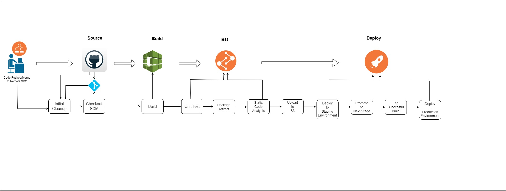

# CD Pipeline for Software Products

NOTE: Server(s) on which the CI/CD environment is to be set up is to be provisioned in the public subnet. For now, we use only a server called Bastion. Check the **Infrastructure Architecture** drawing for reference. Also, because of cost some implementation  as seen on **Infrastructure Architecture** was bypassed for now. Ask for more details on this.

### Pre-requisite Knowledge
- Proficient with Ansible
- Proficient with Jenkins
- Proficience in CI/CD workflow and technologies

## CI/CD Environment Set-Up

### Server RequirementS for CI/CD environment
- atleast 8GB RAM, 2 vCPUs
- atleast 30GB Disk Space (to be resized depending on size of software projects the CI/CD pipeline is handling)

NOTE: Bastion server is currently 15GB RAM, 4vCPUs, 30GB Disk Space

### Technologies employed in the set-up of the CI/CD environment:
- Jenkins (CI tool)
- Ansible (Configuration Management Tool)
- Sonarqube( Static Code Analysis tool)

    #### Set-up Installation & Configuration in the CI/CD environment

    - SSH Bash Agent configuration. *(Find out more on this)*

    - Installation of Ansible 2.10 or above

    - Installation and Configuration of Jenkins and Sonarqube with Ansible. Check ***ci-cd-pipeline*** folder for directory structure.

        **Plugins Installed & Configured on Jenkins UI**

       - Blue Ocean
       - Ansible
       - AWS Credentials
       - Stack Notification Plugin
       - Sonarqube
       - Startup Trigger

          *Check the ***Jenkinsfile*** in the ***ci-cd-pipeline*** folder to understand logic of the stages and how Ansible connected with Jenkins is being used to install, configure and deploy software packages and services into the CI(Continuous Integration) environment and the  respective application environments(Development (dev), Production (prod)).*

## CI/CD Pipeline Workflow for Application Deployment

The CI/CD pipeline can be simple or complex as needed, depending on the project's requirements and the organization's processes.

Generally, a CI/CD Pipeline workflow is basically broken down broadly into these four stages:
- Source
- Build
- Test
- Deploy/Delivery

These stages can act as guides for more distinct or complex workflows.

Checkout the ***Jenkinsfile*** in the application project repositories to see the stages therein.

***NOTE: Go to "System Configuration" and "Security" under "Manage Jenkins" to see the configurations and tokens generated on other tools and input  in Jenkins to make sense of how Ansible is being run automatically from Jenkins and how other tools such as Sonarqube, the servers, AWS services and the VCS used(Github) connect with Jenkins***

See below a pictorial representation of the pipeline workflow:

- **Initial Cleanup**: This stage cleans the workspace by deleting the workspace directory, if it exists, at the  the beginning of the pipeline run

- **Checkout SCM:** This stage checks out the source code from the specified Git repository and branch using the provided credentials.

- **Build:** This stage sets up the environment by renaming a file, cleaning the npm cache in case a cached build persists, installing Husky as a development dependency, installing other npm dependencies, and finally building the project

- **Test:** This stage runs unit tests

- **Package Artifact:** This stage creates a zip archive containing the built artifact.

- **Static Code Analysis:** This stage performs static code analysis using SonarQube on the zip archive containing the built artifact.

- **Upload to S3:** This stage uploads the scanned zip archive(that contains the built artifact)  to a private S3 bucket  using AWS credentials

- **Deploy to Staging Environment:** This stage triggers a Jenkins job  with specified parameters (*InventoryFile* and *Playbooks*) to deploy the application to a staging environment. 

    *Note:* Check and analyse the Jenkinsfile of this repository to understand how a Jenkins job  can be triggered from another  repository.

- **Promote to Next Stage:** This stage prompts for manual input to promote the deployment to the next stage. If the input is received within a timeout of 1 minute, the pipeline continues; otherwise, it may abort

- **Tag Successful Build:** This stage creates a Git tag for successful builds with a name based on the current date and build number. It then pushes the tag to the Git repository. This stage is included so the most recent stable state can be reverted to in case a bug is detected in a new puah to production environment.

- **Deploy to Production Environment:** This stage triggers a Jenkins job (ci-cd-pipeline/main) with parameters (InventoryFile and Playbooks) to deploy the application to the production environment. The job waits for completion and propagates the result.

- **Clean Workspace:** This stage cleans up the workspace, deleting it based on different conditions (aborted, failure, not built, unstable).

